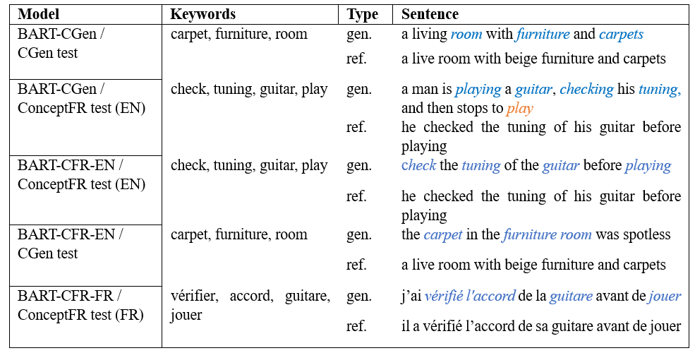

# ConceptFR dataset
This repository presents bilingual English–French dataset and benchmark with parallel data ConceptFR for constrained text generation task.
The dataset contains 28K of English–French sentence pairs with the keywords and a main concept for each data entry. 
This dataset targets testing the generative abilities of a model to produce a commonsense knowledge text given a set of keywords as a condition.


## Statistics

The statistics on the whole dataset is given in Table 1, showing the number of entries in each set, the number of keywords in each size category, minimum, maximum and median lengths of English (EN) and French (FR) sentences. 
The sentence length was calculated with the GEM-metrics package. 
The validation and test splits were extracted from a golden subset.

---
Table 1. Dataset basic statistics
---
</br>

</br>


## Dataset construction

The dataset was built in a semi-automatic way, via data retrieval from translation sites, which provided a sentence illustrating a common concept usage in English and French. 
The scraped data contained a concept-sentence pair, while the keywords were further retrieved using Spacy via part-of-speech (POS) filtering.
The targeted POS of the main concept included nouns, verbs, adjectives and adverbs - other parts of speech were not considered.


## Data cleaning

The scraped material needed further adjustments within a concept–sentence pair as well as within the language pair. 
An automated cleaning pipeline was applied to the data cleaning and consisted of length filtering, language switch, similarity calculation between English and French sentences, concepts validity verification and filling in missing French main concepts.

### Length filtering
The length requirements were applied to several parameters of scraped data, filtering out the entries outside the defined length windows:
-	The minimum length of a main concept was set to 2 characters, assuming, that words containing less than 2 characters cannot be a valid representation for POS of interest (noun, verb, adjective, adverb).
-	The number of keywords was set between 3 and 7, assuming, that at least 3 keywords must be provided to convey a meaningful sentence, while more than 7 keywords might result in a generation of sentences, lacking internal agreement between words, due to a large pool of possible combinations.
-	The minimum unigrams’ length was set to 4 unigrams and was defined by the minimum number of keywords. Therefore, the sentence must contain at least one more unigram for the model to predict. 

### Language switch
Despite correct HTTP requests, some sites were returning incorrect language pairs, either switching the English and French sentences or returning the sentences in languages, different from the languages specified in the request. 
To resolve this issue, a language detection API  was applied, filtering out sentences in languages other than English or French. 
The application of the same API allowed switching the sentences to match the defined language, when required.

### Similarity calculation
The sites with the content compiled dynamically were susceptible to returning the language pairs with no semantic match. 
For this problem, a multilingual version of <a href="https://github.com/Tiiiger/bert_score">BERTScore</a> was applied, measuring the semantic correspondence between English–French sentence pairs. 
It was observed, that the sentences with a BERTScore below 0.7 had no semantic match, therefore were eliminated from the dataset.

### Concepts validity verification
The automated cleaning also included the elimination of entries, where the main concept was not informative (abbreviations) or contained insults, done via a manual check of the validity of concepts.

### Missing French main concepts replacement
Whenever the French equivalent of the main English concept was not scraped, filling in the missing French concept was done using <a href="https://pypi.org/project/detectlanguage/">deep-translator API</a>. 
The verification of the concept translation correctness was done via mapping between the main concept and the keywords extracted with POS filter. 
Thus, the French concept received via translation had to be found in the French keywords, extracted from the sentence.


## Golden subset

The human review of the gathered data was applied to build a golden partition of data. The human review has several advantages, such as:

-	A perfect concept coverage in the sentence (while the automatically treated data might contain a synonym, used as a replacement of the searched concept in a sentence); 
-	Entries, free from redundant information regarding the concepts (alternative formulations, frequent use with other words etc.);
-	Filtered out auxiliary verbs from the keywords’ set, used to create a language tense and left as semantically meaningful by the Spacy POS tagger.
-	POS tag column creation for the main French concept, corresponding to the concept usage in a French sentence. 

The nomenclature for POS tagging is given befow:

```
'v' 		– verbe
'f' 		– nom féminin au singulier
'm' 		– nom masculin au singulier
'm/f'		– nom qui peut être féminin et masculin (ex. ’photographe’)
'pl f' 		- nom féminin qui n’existe qu’en pluriel (ex. ’agapes’)
'pl m' 		– nom masculin qui n’existe qu’en pluriel (ex. ’parages’)
'adj' 		– adjectif
'adv' 		– adverbe
```

The corrections were provided by 6 company employees, native French speakers with higher education in IT and related fields with an intermediate knowledge of English. 
The group participants were of mixed age (from 27 to 41) and sex (2 females and 3 males). 
Each participant signed an agreement for the internal use of personal data, with the insurance of personal data privacy. 
The agreement was approved by the internal ethics board of the Inetum group. 
The salary during the project participation was maintained at the same level as for the positions the employees were initially recruited.
	
In order to reduce human error and provide control over corrections, we developed a pipeline of automated tests. 
The automatic review script verified a concept coverage in the sentence for both languages, presence of the additional information regarding the concepts, the keywords set length correctness and the presence of the personal names (the names were replaced with the pronouns, according to the correction conditions). 
After the automatic review completion, the script generated an overview of a set of potential errors for each entry, facilitating the understanding of the output summary for the author of correction and data collector. 
In case of erroneous entries, the file with the script’s automated remarks was returned to the corrector and the process continued until no errors were left.	

A full list of the correction conditions is given below:
```
1.	Est-ce que le concept en français est présent ? Si non, veuillez le mettre en le copiant à partir du texte de la phrase initiale en français.
2.	Est-ce que le concept est à l’infinitif ? Si non, veuillez le mettre à l’infinitif. 
3.	Est-ce que le concept est présent dans la phrase ? Si non, remplacer le synonyme utilisé dans la phrase par le concept.
4.	Est-ce que l’utilisation grammaticale du concept dans la phrase correspond au tag décrivant sa catégorie grammaticale (verbe, nom, adjectif etc.) ? Si non, changez le tag (la liste des tags est donnée en bas de page). Si le tag du concept est autre que : verbe, nom, adjectif ou adverbe, rajouter la colonne eliminate et préciser la raison “tag”.
5.	Est-ce que le concept est suivi d’information additionnelle ou de son synonyme (entre parenthèses, cf. exemple ci-dessous) ? Le cas échéant, supprimer l’information additionnelle ou son synonyme :
6.	Est-ce que la phrase en français a le même sens que la phrase en anglais ?
7.	Est-ce que les phrases sont complètes et ne continent pas d’information additionnelle ? Le cas échéant, supprimer l’information additionnelle :
8.	Est-ce que les phrases contiennent des noms/prénoms personnels ? Si oui, remplacer le nom/prénom personnel par le pronom correspondant (cf. exemple ci-dessous) :
9.	Est-ce que les chiffres sont écrits avec leurs équivalents verbaux ? (Exemple : cent au lieu de 100).
10.	Est-ce que la quantité de mots-clés est entre 3 et 7 (selon la longueur de la phrase) ?
11.	Est-ce que les mots-clés sont à l’infinitif ?
12.	Les mots clés ne doivent pas contenir les verbes utilisés pour la conjugaison (cf. exemple ci-dessous) :
13.	Est-ce que les mots-clés représentent la structure de la phrase ? Ces mots-clés doivent être suffisamment représentatifs pour créer la phrase avec le même sens par un modèle d’IA par la suite.
14.	Le texte illustrant l’utilisation du concept est composé d’une seule phrase. Si ce n’est pas le cas, rajouter la colonne eliminate et préciser la raison “2 phrases”.
15.	Le texte illustrant l’utilisation du concept de doit pas contenir des insultes, les expressions racistes ou sexistes, encourager la discrimination ou la violence. Si ce n’est pas le cas, rajouter la colonne eliminate et préciser la raison “ethics”.
16.	Si l’entrée est invalide pour une autre raison que “tag”, “2 phrases” ou “ethics”, rajouter la colonne eliminate et préciser la raison “misc”.
```


## Splits formation

The golden subset was used to select entries for the test and validation splits. 
The main reason for this step was a complete correspondence between French and English partitions of data, expressed in the same keywords length and POS of the main concept. 
The equalized partition totaled 3K entries (1500 for test and 1500 for validation splits). 
The remaining 3266 entries are provided in a separate split, which can be added to the training set or used for additional validation tests.

The main filtering criteria, deciding for the entry inclusion to either test or validation split, consisted of an equal number of keywords between French and English dataset partitions. 
For example, if the number of English keywords equalled 3, the number of French keywords of the same entry had to be equal to 3 as well. 
The number of entries that satisfied this criterion totalled 3900, from which only 3000 were left, due to the groups’ equalization. 
The groups affected by the equalization process contained 3, 4 and 5 keywords respectively, since these groups contained the biggest number of entries. 
The groups with 6 and 7 keywords were less numbered, therefore no equalization process was applied to balance the keywords’ quantities. 
The candidates for elimination were defined by the grouping of entries according to the POS tag of the main concepts. 
Thus, the equalization of the POS groups allowed to filter out redundant entries, exceeding the equality limit. 
The entries selected via such an elimination process contained the prevailing number in the groups of nouns and verbs as a POS descriptor of the main concept.

The final POS profile of the test and validation splits is shown in Fig. 1. 
As we can see, the prevailing number of entries have verb and noun POSs for the main concept. 
We can also observe a similar distribution of the POS groups for the constructed test and validation splits, which ensures the equivalence of data within the splits.


</br>

<em>Figure 1. POS profiles of the main concept in validation and test sets: m and f stand for masculine and feminine nouns, v, adj and adv stand for verb, adjective and adverb respectively, mf represents the noun which may be masculine and feminine at the same time, plm and plf represent masculine and feminine nouns that exist in a plural form only.</em>
</br>


## Experiment
We choose the BART-base multilingual pre-trained transformer [[1]](https://arxiv.org/abs/1910.09700) for the finetuning of three models on English and French partitions of the ConceptFR data (BART-CFR-EN and BART-CFR-FR models respectively) and on CommonGen data in English (BART-CGen model). 
We then test the BART-CGen and BART-CFR-EN models, both trained on English texts, with the test set from the CommonGen and English partition of the ConceptFR datasets. 
Therefore, a cross-validation of the results is performed – the model generates sentences out of the keywords containing the vocabulary, similar to the data used during the training phase, as well as out of the keywords with unfamiliar vocabulary. 
The cross-validation between English models allows comparing the complexity of the content from the ConceptFR and CommonGen datasets. Further comparison is done with the text generated by the BART-CFR-FR model, using the ConceptFR French data partition. 
The latter accounts for the language richness factor.
More details on the experiment can be found in a dedicated paper [[2]](https://arxiv.org/abs/1910.09700).


## Preparation of the existing benchmark for comparison experiment

In order to meet the level of diversity inherent to the ConceptFR dataset, we apply several steps for data filtering of the CommonGen dataset before creating a finetuned model on CommonGen data, such as:
1.	Elimination of target sentence duplicates.
2.	Elimination of concept set duplicates.
3.	Elimination of target sentences with the same or very similar content.
4.	Elimination of sentences with non-common or non-sense content.
The examples of eliminated content are given in Table 2.
---
Table 2. Examples of eliminated entries from the CommonGen dataset
---
</br>

</br>

## Generated text

The analysis of the generated content by three finetuned models (Table 3) reveals that the generations made by the BART-CGen model lack the order of the covered keywords, which is explained by the organization of the training data (the order of the keywords and their appearance in a reference sentence do not correlate). 
The same BART-CGen model also tends to include redundant keywords when unseen input is given, which was reflected already by diversity metrics. 
The BART-CFR-EN model generates coherent sentences with good concept coverage and as its English counterpart (BART-CGen), uses the gerund forms of verbs. 
The text generated by BART-CFR-EN model also tends to be more imperative, while the BART-CGen model generates more descriptive sentences. 
No drop in performance was observed when the BART-CFR-EN model was requested to generate a sentence with the keywords of unfamiliar style. 
Finally, the French BART-CFR-FR model also generates coherent, grammatically correct sentences, similar to the model trained on parallel English partition of the ConceptFR data (BART-CFR-EN).

---
Table 3. Examples of generated text (gen.) compared to the target references (ref.). Blue color marks the correct inclusion of the keyword, orange – a redundant inclusion.
---
</br>

</br>

## Gender distribution

The dataset is slightly biased in terms of gender representation with 10,2% of entries labeled as feminine, 16,48% as masculine and 73,32% as neutral content. 
The bias detection was done with Gender Bias Filter from the NL-Augmenter package released with the 2nd GEM edition [6], using an English partition of the ConceptFR dataset. 
We will work towards the elimination of this bias in the 2nd edition of the dataset.


## Carbon print

Experiments were conducted using Jupiter notebooks in Colab (GPU) and Kaggle (CPU) environments. 
A cumulative of 4 hours of computation was performed on the hardware of type GPU (NVIDIA Tesla K80 GPU) and 45 hours of computation was performed on the hardware of type CPU (Intel(R) Xeon(R) CPU). 
Total emissions are estimated to be 0,66 kgCO2. 
Estimations were conducted using the CodeCarbon emissions tracker [[3]](https://arxiv.org/abs/1910.09700), [[4]](https://arxiv.org/abs/1911.08354).


## Limitations

Despite the effort in automated cleaning pipeline application, the entries outside the golden subset might contain biased content, therefore should be used with caution for training models in legally bounding or decision-making contexts, where gender, race or other ethical factors play an important role and may induce discrimination towards minority groups. 
The data gathered in this project may be used for research purposes only. 
The legal allegations which may arise from the non-intended use of the gathered data do not apply to the data collector.


## References

_[1]_
```bibtex
@misc{lewis2019bart,
      title={BART: Denoising Sequence-to-Sequence Pre-training for Natural Language Generation, Translation, and Comprehension}, 
      author={Mike Lewis and Yinhan Liu and Naman Goyal and Marjan Ghazvininejad and Abdelrahman Mohamed and Omer Levy and Ves Stoyanov and Luke Zettlemoyer},
      year={2019},
      eprint={1910.13461},
      archivePrefix={arXiv},
      primaryClass={cs.CL}
}
```

_[2]_
```bibtex
@misc{shvets2023conceptfr,
      title={ConceptFR: a Bilingual English–French Dataset for Natural Language Generation}, 
      author={Anna Shvets},
      year={2023},
      eprint={cmp-lg/9508001},
      archivePrefix={arXiv},
      primaryClass={cmp-lg}
}
```

_[3]_
```bibtex
@misc{lacoste2019quantifying,
      title={Quantifying the Carbon Emissions of Machine Learning}, 
      author={Alexandre Lacoste and Alexandra Luccioni and Victor Schmidt and Thomas Dandres},
      year={2019},
      eprint={1910.09700},
      archivePrefix={arXiv},
      primaryClass={cs.CY}
}
```
_[4]_
```bibtex
@misc{lottick2019energy,
      title={Energy Usage Reports: Environmental awareness as part of algorithmic accountability}, 
      author={Kadan Lottick and Silvia Susai and Sorelle A. Friedler and Jonathan P. Wilson},
      year={2019},
      eprint={1911.08354},
      archivePrefix={arXiv},
      primaryClass={cs.LG}
}
```
